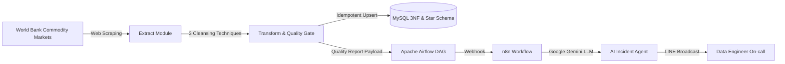

# 📊 World Bank Commodity Price Automated ETL Pipeline & Agentic AI

An enterprise-grade Data Engineering project designed for automated scraping, cleaning, 3NF database storage, Airflow orchestration, and Agentic AI notifications (via n8n and LINE) of the World Bank Commodity Markets ("The Pink Sheet") data.

---

## 🏗️ Architecture Overview



---

## 🚀 Key Features

1. **Step 1: Automated Web Scraping (`src/extract.py`)**:
   - Automatically crawls `https://www.worldbank.org/en/research/commodity-markets`.
   - Locates and extracts the latest "Monthly prices" Excel dataset with fallback retries.

2. **Step 2: Advanced Data Cleansing (3 Techniques) (`src/transform.py`)**:
   - **Technique 1**: Missing value handling, ISO date parsing (`1960M01` $\rightarrow$ `1960-01-01`), and numeric casting.
   - **Technique 2**: Text normalization, header sanitization (asterisk removal), and unit cleaning.
   - **Technique 3**: Reshaping (Wide-to-Long unpivot / melt) 71 commodities and joining metadata (`Group_Product`, `Description`, `Source`).
   - Generates **56,800+ rows** and builds a deterministic **Quality Report for Agent**.

3. **Step 3: Database & Warehouse Management (`src/database.py`)**:
   - Relational Database (MySQL) design justified for ACID transactions, strict schema integrity, and time-series analytical queries.
   - **3NF & Star Schema**:
     - `dim_commodity`: Dimension table for 71 commodities (3NF).
     - `fact_monthly_prices`: Fact table for monthly prices (3NF).
     - `monthly_prices`: Denormalized table for direct consumption.
   - Idempotent batch loading with `INSERT ... ON DUPLICATE KEY UPDATE`.

4. **Step 4: Airflow DAG Orchestration (`dags/world_bank_commodity_etl.py`)**:
   - 5 modular tasks: `extract_world_bank` $\rightarrow$ `validate_raw_data` $\rightarrow$ `transform_data` $\rightarrow$ `load_to_mysql` $\rightarrow$ `agentic_ai_notify`.
   - Scheduled monthly (`0 6 5 * *`) on the 5th of each month.

5. **Step 5: Agentic AI & n8n Automation (`src/agentic_ai.py` & `Airflow_notification.json`)**:
   - Evaluates Data Quality Gate (`severity`, `human_review_required`, `safe_to_publish`).
   - Calculates key market movements (Top MoM Gainers and Decliners).
   - Dispatches payload to n8n webhook and sends executive Thai incident reports to LINE.

6. **Interactive Jupyter Notebook (`world_bank_commodity_etl.ipynb`)**:
   - Comprehensive end-to-end tutorial with step-by-step code, profiling, and analytics.

---

## 📁 Repository Structure

```text
├── dags/
│   └── world_bank_commodity_etl.py     # Airflow DAG definition
├── docs/
│   ├── database_design_and_justification.md # RDBMS vs NoSQL & 3NF analysis
│   ├── presentation_slide_plan.md      # 5-min presentation slide plan
│   └── project_report.md               # Complete project rubric report
├── src/
│   ├── extract.py                      # Web scraping module
│   ├── transform.py                    # Cleansing & Quality Gate module
│   ├── database.py                     # Schema initialization & MySQL loader
│   ├── query_analytics.py              # Analytical SQL queries via Python
│   └── agentic_ai.py                   # AI prompt & n8n webhook dispatcher
├── world_bank_commodity_etl.ipynb      # Complete Jupyter Notebook
├── Airflow_notification.json           # n8n Workflow template for LINE
├── Project.md                          # Project assignment requirements
└── README.md                           # Documentation
```
