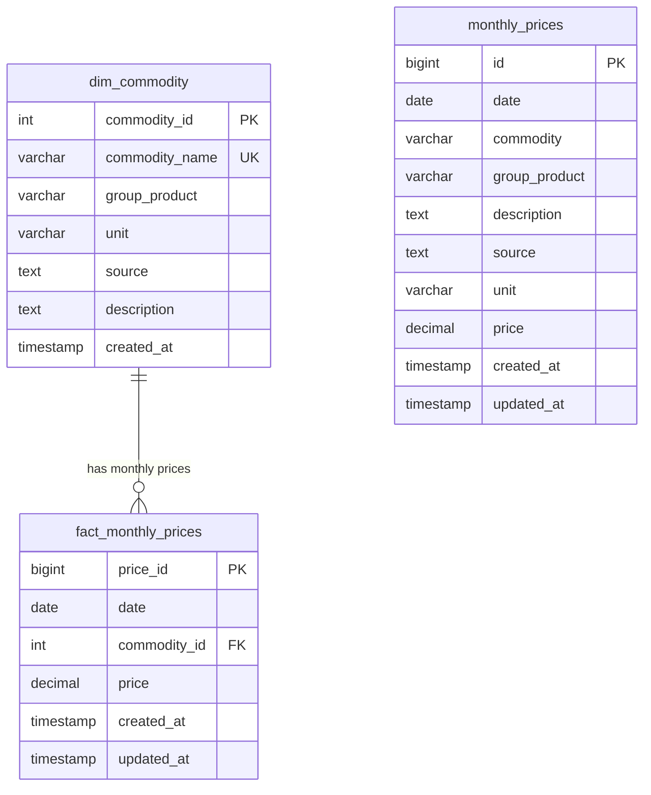

# 📑 การออกแบบฐานข้อมูลและเหตุผลทางเทคนิค (Database Design & Justification)
### เกณฑ์การประเมินข้อ 2.1 และ 2.2 (10 คะแนนเต็ม)

---

## 1. การให้เหตุผลทางเทคนิค: Relational Database vs Non-Relational Database (เกณฑ์ข้อ 2.1: 3 คะแนน)

ในโครงงาน **World Bank Commodity Price Data Pipeline** นี้ ทางทีมได้พิจารณาเปรียบเทียบระหว่าง **Relational Database (RDBMS - MySQL)** และ **Non-Relational Database (NoSQL - MongoDB / Document Store)** โดยมีเหตุผลสำคัญที่เลือกใช้ **Relational Database (MySQL)** ดังต่อไปนี้:

### 1.1 โครงสร้างข้อมูลเป็นแบบตารางคงที่และมีความสัมพันธ์ชัดเจน (Structured Schema & Foreign Key Constraints)
- ข้อมูลราคาสินค้าโภคภัณฑ์รายเดือนของธนาคารโลก (World Bank Pink Sheet) เป็นข้อมูลเชิงโครงสร้าง (Structured Time-series) ที่มี Schema ชัดเจนแน่นอน ประกอบด้วย วันที่ (`Date`), รหัสสินค้า (`Commodity ID`), และราคา (`Price`)
- การใช้ RDBMS ช่วยบังคับใช้ความถูกต้องของข้อมูลผ่าน **Data Types**, **NOT NULL Constraints**, และ **Foreign Key Relationships** ป้องกันไม่ให้เกิดข้อมูลที่ผิดพลาด (Data Corruption) ซึ่ง NoSQL มักปล่อยให้เป็นหน้าที่ของ Application-level Validation ที่อาจเกิดความผิดพลาดได้ง่ายกว่า

### 1.2 ความสมบูรณ์ของธุรกรรมระดับ ACID (Atomicity, Consistency, Isolation, Durability)
- เนื่องจาก Data Pipeline มีการโหลดข้อมูลเพิ่มขึ้นทุกเดือน (Monthly Updates) ความสามารถในการทำ **ACID Transaction** มีความสำคัญยิ่ง หากเกิดข้อผิดพลาดระหว่างการ Batch Insert กลไก Transaction ของ MySQL จะทำการ Rollback ข้อมูลทันที เพื่อไม่ให้เกิดภาวะข้อมูลค้างคาหรือบันทึกไม่ครบถ้วน

### 1.3 ประสิทธิภาพในการประมวลผลเชิงวิเคราะห์ด้วย SQL (Analytical Aggregation & Window Functions)
- ข้อมูล Time-series ของราคาสินค้าโภคภัณฑ์ต้องถูกนำไปคำนวณสถิติ เช่น การคำนวณการเติบโตเดือนต่อเดือน (MoM % Change), การหาค่าเฉลี่ยรายปี (Annual Average), และการวัดความผันผวน (Price Volatility / Standard Deviation)
- MySQL รองรับ **SQL Window Functions (`LAG`, `LEAD`, `OVER (PARTITION BY...)`)** และ **GROUP BY Aggregations** ที่ทำงานบน RDBMS Engine ได้อย่างรวดเร็วและใช้หน่วยความจำต่ำมาก เมื่อเทียบกับการเขียน Map-Reduce หรือ Aggregation Pipeline ซับซ้อนใน NoSQL

---

## 2. การออกแบบฐานข้อมูลตามหลักการนอร์มัลไลเซชัน (3NF) และ Star Schema (เกณฑ์ข้อ 2.2: 3 คะแนน)

เพื่อรองรับทั้งข้อกำหนดของโจทย์ และหลักการสากลของ Data Engineering ทางระบบจึงได้ออกแบบฐานข้อมูลแบ่งออกเป็น **Dimension Table**, **Fact Table** ตามหลัก **Third Normal Form (3NF)** และเตรียมตาราง Denormalized ตามข้อกำหนดของอาจารย์:

### 2.1 สถาปัตยกรรม 3NF (Third Normal Form)

#### 1) Dimension Table: `dim_commodity` (ตารางมิติสินค้า)
- **วัตถุประสงค์**: แยกข้อมูลอธิบายของสินค้า (เช่น กลุ่มสินค้า, หน่วยนับ, แหล่งที่มา, คำอธิบาย) ออกจากตารางราคา เพื่อกำจัด **Transitive Dependency** (ตามกฎ 3NF: $X \rightarrow Y$ และ $Y \rightarrow Z$)
- **Columns**:
  - `commodity_id` (INT, Primary Key, Auto Increment)
  - `commodity_name` (VARCHAR(100), Unique Key)
  - `group_product` (VARCHAR(100), Indexed)
  - `unit` (VARCHAR(50))
  - `source` (TEXT)
  - `description` (TEXT)
  - `created_at` (TIMESTAMP)

#### 2) Fact Table: `fact_monthly_prices` (ตารางข้อเท็จจริงราคา)
- **วัตถุประสงค์**: จัดเก็บเฉพาะตัวเลขราคาและวันที่ในระดับแถว ซึ่งมีความสัมพันธ์แบบ 1-to-Many กับ `dim_commodity` ช่วยลดขนาดพื้นที่จัดเก็บและเพิ่มความเร็วในการสแกนข้อมูล
- **Columns**:
  - `price_id` (BIGINT, Primary Key, Auto Increment)
  - `date` (DATE, Indexed)
  - `commodity_id` (INT, Foreign Key referencing `dim_commodity.commodity_id`)
  - `price` (DECIMAL(12, 4), Nullable)
  - `created_at`, `updated_at` (TIMESTAMP)
  - **Constraint**: `UNIQUE KEY uk_fact_date_commodity (date, commodity_id)` ป้องกันข้อมูลซ้ำซ้อน

#### 3) Denormalized Table: `monthly_prices`
- จัดเก็บโครงสร้างแบบ Flat Table ทั้ง 7 คอลัมน์ตามข้อกำหนดใน Step 3 ของโจทย์ เพื่อให้ผู้ใช้ทั่วไปสามารถเรียกดูข้อมูลแบบ Single-table Query ได้สะดวกโดยไม่ต้อง Join

---

## 3. วิธีการจัดเก็บข้อมูลดิบและกระบวนการ Ingestion สู่ระบบ (Ingestion Methodology)

1. **Staging & Validation**:
   - ข้อมูลดิบถูกสกัดจากไฟล์ Excel ผ่านกระบวนการ Cleansing และสร้าง Quality Gate
2. **Idempotent Batch Upsert (`ON DUPLICATE KEY UPDATE`)**:
   - เมื่อมีข้อมูลเดือนใหม่ถูกส่งเข้ามา ระบบจะไม่ทำการ Drop ตารางทิ้ง แต่จะใช้คำสั่ง SQL `INSERT ... ON DUPLICATE KEY UPDATE` โดยตรวจสอบจาก Composite Unique Key `(date, commodity)`
   - **ข้อดี**: การรันซ้ำกี่ครั้งก็ได้ผลลัพธ์เดิม ไม่เกิดข้อมูลเบิ้ล (Idempotency) และไม่กระทบต่อข้อมูลประวัติศาสตร์ในอดีต
