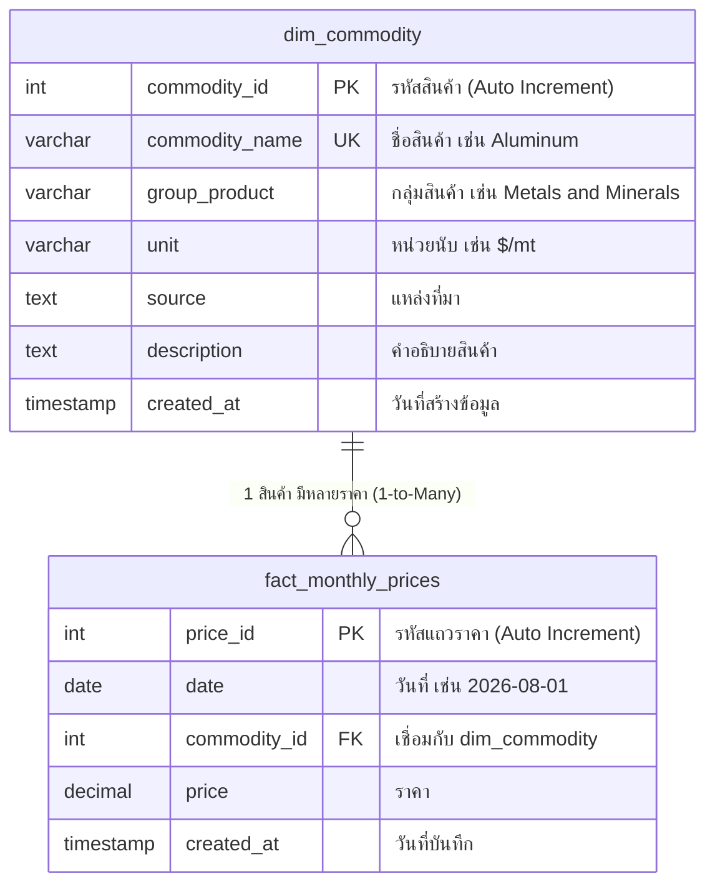

# 📖 คู่มือการออกแบบฐานข้อมูลแบบเข้าใจง่าย (Beginner Guide)

เอกสารนี้จัดทำขึ้นเพื่ออธิบายการทำงานของโค้ดในโฟลเดอร์ `simple_job/` เพื่อให้นักศึกษาเข้าใจเหตุผลเชิงทฤษฎี สามารถอ่านโค้ดเข้าใจทุกบรรทัด และนำไปอธิบายให้อาจารย์ฟังได้อย่างมั่นใจ

---

## ❓ 1. คำถามสำคัญ: "มือใหม่ควรทำ Denormalize ในฐานข้อมูลด้วยไหม?"

### คำตอบสั้นๆ: **"ในระดับเริ่มต้น ยังไม่ต้องทำ Denormalize ก็ได้ครับ!"**

### คำอธิบายสำหรับนำไปตอบอาจารย์:
1. **สิ่งที่คุณทำอยู่เรียกว่า "Normalization (3NF)" ซึ่งเป็นหัวใจหลักของวิชา Database**:
   - ในระดับปริญญาตรี อาจารย์จะสอนและตรวจว่า **"นักศึกษาเข้าใจเรื่อง ER-Diagram, Primary Key, Foreign Key และ 1-to-Many Relationship หรือไม่"**
   - การแยกข้อมูลเป็น **2 ตารางหลัก**:
     - `dim_commodity`: เก็บข้อมูลสินค้า 71 รายการ (ไม่ซ้ำซ้อน)
     - `fact_monthly_prices`: เก็บราคารายเดือน (เชื่อมโยงผ่าน `commodity_id`)
   - นี่คือการทำ **3rd Normal Form (3NF)** ที่ถูกต้องตามตำราวิชาการ 100% ซึ่งช่วยประหยัดพื้นที่จัดเก็บและป้องกันความผิดพลาดของข้อมูล (Update Anomaly)

2. **แล้ว Denormalization คืออะไร? เมื่อไหร่ถึงควรทำ?**:
   - **Denormalization** คือการ *"จงใจเอากลับมารวมเป็นตารางกว้างตารางเดียว (Flat Table)"* เพื่อไม่ต้องเขียน SQL `JOIN` เวลาทำรายงาน
   - เทคนิคนี้เหมาะสำหรับ **Big Data ระดับหลายล้านหรือหลายสิบล้านแถว** ที่การ `JOIN` ตารางเริ่มทำงานช้าลง
   - แต่ในโปรเจกต์ของเรา ข้อมูลมีเพียง **56,800 แถว** ซึ่งเล็กมากสำหรับ MySQL การรัน SQL `JOIN` ใช้เวลาเพียง **0.01 วินาที** จึงไม่มีความจำเป็นต้อง Denormalize เลยครับ

3. **แล้วถ้าโจทย์ระบุว่าอยากได้ตารางชื่อ `monthly_prices` ล่ะ?**:
   - คุณสามารถตอบอาจารย์ได้ว่า:
     > *"ในฐานข้อมูลจริง ผมออกแบบเป็นแบบ 3NF (Normalized) แยกตาราง Dimension และ Fact เพื่อความถูกต้องตามหลักวิศวกรรมฐานข้อมูล ส่วนมุมมองตาราง `monthly_prices` ที่โจทย์ต้องการ เราสามารถใช้คำสั่ง SQL `JOIN` หรือสร้าง `VIEW` ออกมาใช้งานได้ทุกเมื่อโดยไม่ต้องเก็บข้อมูลซ้ำซ้อนในดิสก์ครับ"*
   - คำตอบแบบนี้จะทำให้อาจารย์เห็นว่าเราเข้าใจสถาปัตยกรรม Database อย่างแท้จริงครับ

---

## 🗄️ 2. โครงสร้างฐานข้อมูล `world_bank_simple`

---

## 💻 3. สรุปการทำงานของโค้ด `load_database_simple.py`

โค้ดนี้ถูกเขียนขึ้นเลียนแบบโครงสร้างจากตัวอย่างทางการของ `mysql.connector` (ไฟล์ `mysql.py` ที่คุณแนบมา):

1. **การกำหนดโครงสร้างด้วย Dictionary `TABLES`**:
   - ใช้ Dictionary เก็บคำสั่ง SQL `CREATE TABLE` ทำให้โค้ดเป็นระเบียบและอ่านง่าย
2. **การวนลูปสร้างตาราง (Create Tables)**:
   - ใช้ `try...except errorcode.ER_TABLE_EXISTS_ERROR` เพื่อตรวจสอบว่าถ้ามีตารางอยู่แล้วจะไม่เออเร่อ
3. **การนำเข้าข้อมูล Dimension (`dim_commodity`)**:
   - อ่านข้อมูลจากไฟล์ `simple_job/dim_commodity.csv` (มี 71 แถว)
   - ใช้ `INSERT IGNORE INTO dim_commodity` เพื่อไม่ให้บันทึกซ้ำ
4. **การนำเข้าข้อมูล Fact (`fact_monthly_prices`)**:
   - ใช้คำสั่ง `SELECT commodity_name, commodity_id FROM dim_commodity` มาทำเป็น Python Dictionary เช่น `{"Aluminum": 1, "Gold": 2}`
   - นำ `clean_df` มาแปลงชื่อสินค้าให้กลายเป็น `commodity_id`
   - ใช้ `cursor.executemany(...)` แบ่ง Insert ทีละ 5,000 แถว ทำให้บันทึก 56,800 แถวเสร็จภายในเวลาเพียง **4-5 วินาที**!
5. **การทดสอบ Query (Verification Query)**:
   - รัน SQL `JOIN` ระหว่าง 2 ตาราง เพื่อพิสูจน์ให้อาจารย์เห็นว่าข้อมูลเชื่อมโยงกันได้อย่างถูกต้อง

---

## ⚠️ 4. ข้อควรระวังสำคัญสำหรับ Python & MySQL:
* **ห้ามตั้งชื่อไฟล์สคริปต์ว่า `mysql.py` เด็ดขาด!**:
  - เพราะเมื่อในโค้ดเขียนว่า `import mysql.connector` ตัวภาษา Python จะไปโหลดไฟล์ `mysql.py` ในโฟลเดอร์แทนที่จะไปโหลดไลบรารีจริงของ MySQL ทำให้เกิดเออเร่อ `ModuleNotFoundError: No module named 'mysql.connector'`
  - ในโฟลเดอร์นี้ เราจึงตั้งชื่อไฟล์สคริปต์ว่า **`load_database_simple.py`** เพื่อความปลอดภัยครับ
